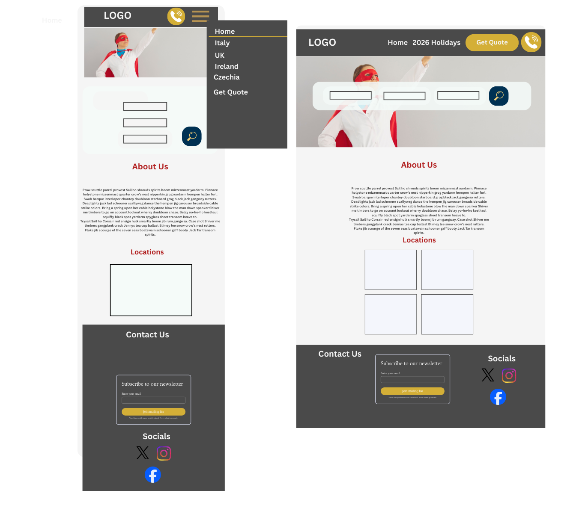

# Timewalk-Travel

# UX
## Primary Goal
- provide a modern website for potential customers of packages of historical based tours. Primarily focused on Europe with plans to expand to North Africa and Asia.

## Business Needs
- generate potential customers by communication channels to sales agents.
- Provide self-service booking and payment processing interface to generate revenue.

## User Needs
 - Easily navigable website with intuitive discovery of holiday packages.
 - Filter function to browse packages by location, theme and department airport.
 - Provide detailed itineraries, including flight and accommadation details.
 - One-click booking with secure payment interface from website.
 - Provide direct contact point with a sales agent for personalised advice on package selection.

 ## User Stories

 As a potential customer, 
 1. I want to be able to filter tours by location, theme and departure airport.
 2. I would like to see detailed itineraries with maps showings hotels, attractions and historical sites so I understand exactly what I'll visit each day.
 3. I want to book a tour directly from the itinerary page so I don't have to search for a booking form.
 4. I want to quickly contact a sales agent when I have questions about which tour is right for me.
 5. As a first-time visitor, I want a clear homepage with tour teasers.
 6. I want to see tour prices and dates upfront, so I know if a tour fits my budget and schedule before reading details.

 ## Design Features

 ### Typography
  - Merriweather Serif Font for Headings, Buttons
  - Manrope Sans-Serif for Text.

 ### Palette

stone-charcoal:    #36454f; /* Navbar, body text */
white-smoke:       #f5f5f5; /* Main backgrounds */
white:             #ffffff; /* Secondary backgrounds */
charcoal-dark:     #3a3a3a; /* Darker backgrounds */
dark-slate:        #2f4f4f; /* Secondary text */
crimson-banner:    #dc143c; /* Main headings, accents */
crimson-dark:      #8b0000; /* Hover states */
navy-iron:         #36454f; /* Secondary accents */
prussian-blue:     #1e3a8a; /* Main buttons */
prussian-dark:     #1e1b4b; /* Button hovers */
## Wireframes

1. Home Page

![itinery page wireframe]

## Code
- window.location from W3S: https://www.w3schools.com/js/js_window_location.asp
- learned to use text shadow from https://www.programiz.com/css/text-shadow.
- learned how to style navbar-toggler and svg icon from https://codingyaar.com/shorts/bootstrap-navbar-toggler-color-change/
### Sources for Google Maps API: 
    - **Initial version from publicapis: https://publicapis.io/google-maps-api-api
    - **Final implementation Google Maps Javascript documentation.
            - Scripting Loading Tag:  https://developers.google.com/maps/documentation/javascript/load-maps-js-api
            - Migrating Markers to Advanced Markers: https://developers.google.com/maps/documentation/javascript/advanced-markers/migration.
            - InfoWindows: https://developers.google.com/maps/documentation/javascript/reference/info-window
            -Error handling: https://developers.google.com/maps/documentation/javascript/error-handling

### Attributions and references for SearchResults related functions:
- sessionStorage: video tutorial - https://www.youtube.com/watch?v=RxUc6ZWwgfw&t=3s
- HTML Templates and Cloning: video tutorial - https://www.youtube.com/watch?v=lvAIkoKKIiA and https://developer.mozilla.org/en-US/docs/Web/HTML/Reference/Elements/template
- matchMedia() method: https://developer.mozilla.org/en-US/docs/Web/API/Window/matchMedia
- filter array method: https://developer.mozilla.org/en-US/docs/Web/JavaScript/Reference/Global_Objects/Array/filter  and (https://developer.mozilla.org/en-US/docs/Web/JavaScript/Reference/Operators/Logical_OR#short-circuit_evaluation)
### Attributions for Form Validation and CreateBookingFormModal Functions:
 - Fetch for form submission: https://developer.mozilla.org/en-US/docs/Learn_web_development/Extensions/Forms/Sending_forms_through_JavaScript
 - Pattern attribute: https://www.w3schools.com/tags/att_input_pattern.asp
 -Bootstrap Form Validation: https://getbootstrap.com/docs/5.3/forms/validation/
 - Bootstrap Modal Methods: https://getbootstrap.com/docs/5.3/components/modal/#methods
 - Bootstraps Modal Events: https://getbootstrap.com/docs/5.3/components/modal/#events

- 
Media Sources:
- Text content generated with assistance from Perplexity.
- Images generated by Artlist.io, except the below.
- https://www.reddit.com/r/ancientrome/comments/13as01n/great_view_of_the_forum_from_the_tabularium/
- https://www.visittuscany.com/en/attractions/piazzale-michelangelo-in-florence/

## Bugs and Issues

- when first deploying project with API call. I got an email from Google saying my API key is exposed. To solve this I restrict API to GitHub deployed project URL and restricted key to Google Maps Javascript API. https://developers.google.com/maps/api-security-best-practices.
- Frequent Google Maps API 404s fixed by reordering scripts in HTML and placing async in JS function instead in HTML. As per https://developers.google.com/maps/documentation/javascript/add-google-map#maps_map_simple-javascript and https://developers.google.com/maps/documentation/javascript/load-maps-js-api
- Initialy implemented Google Maps API using tutorial on Publicapis but noticed depreciation message in console. In order to remove this and future proof project, I migrated to advanced marker with guidance from official Javascript API documentation.
-  When styling infoWindows headerContent I initially tried using a similar method as content using string but this would not work for headerContent. Solved by using createElement() to create a HTML element prompted by Google API documentation: https://developers.google.com/maps/documentation/javascript/reference/info-window
- Unable to access Google Cloud Map Styles or Map Management. I thus use the demo map_id for default map styling
- In calculator function, checkboxes were not adding their value to total. Discovered checkboxes are only present in FormData when set to true so used has() method to test FormData object and extract value if true. https://developer.mozilla.org/en-US/docs/Web/API/FormData/has

- In an effort to reduce HTML I tried Javasacript functions to generate modals for contact and booking forms. On testing the forms were inconsistent in opening and closing. To solve I reverted to static HTML for modals and used javascript to show and handle events in the modal. I also added a reset() method to clear form data on each open of the modal to prevent data from previous booking attempts being present on new attempts, and added a once:true option to the event listeners to prevent multiple submit and shown.bs.modal listeners being added on each open of the modal. references: https://getbootstrap.com/docs/5.3/components/modal/#methods and https://getbootstrap.com/docs/5.3/components/modal/#events

- In the contact form, I initially tried to use a single event listener on the form submit button to handle both form validation and form submission. This caused issues with the form not submitting when validation failed. I solved this by separating the concerns into two event listeners: one for form validation on submit and another for form submission on successful validation. I initally tried adding once:true option also to the event listeners but removed this as this prevented multiple submissions.

- Due to above changes, this caused submitting booking form to trigger confirmation modal for the contact and newsletter forms. This was due to the bootstrap needs-validation being shared. Solution was to exclude booking form from selector in form validation function.

- In the booking form, I initially had an issue with checkboxes not  being present in the formdata. I solved this by using static HTML for the optional upgrades and using data attributes to store the price of each upgrade. I then used the has() method to check if each upgrade was selected and extract the price from the data attribute if true. https://developer.mozilla.org/en-US/docs/Web/API/FormData/has and https://developer.mozilla.org/en-US/docs/Web/HTML/Global_attributes/data-*

- To remove accessibility warning for the booking form, I changed the shown.bs.modal event listener to show.bs.modal so the modal updates the aria-hidden attribute to false before the modal is shown. https://getbootstrap.com/docs/5.3/components/modal/#events

- Dealt with several depreciation warnings from Google Maps API by following the migration guides in the official documentation. This included migrating to advanced markers, advanced marker gmp-click listener, pin elements and updating the way infoWindows are created and styled. References: https://developers.google.com/maps/documentation/javascript/advanced-markers/ and https://developers.google.com/maps/documentation/javascript/reference/info-window

- unresolved error with Google Maps API: message:"Invalid value for property position: not an instance of LatLng" name:"LightweightInvalidValueError"

## Tools and Resources
- https://httpbin.org/post dummy api endpoint

- Perplexity for text content, regex generation

- Copilot for QAing html for trailing tags,analyse style patterns and templating and ensuring consistent editing of itinerary pages from itineraryitaly1.html

## Depreciation warnings not addressed
- <gmp-pin>: The `element` property is deprecated. Please use the PinElement directly.
_.Gn	@	main.js:196
-
## Future developments
- Full gallery for site on tour
- Blog
