# Timewalk-Travel

# UX
## Primary Goal
- provide a modern website for potential customers of packages of historical based tours. Primarily focused on Europe with plans to expand to North Africa and Asia.

## Business Needs
- generate potential customers by communication channels to sales agents.
- Provide self-service booking and payment processing interface to generate revenue.

## User Needs
 - Easily navigable website with intuitive discovery of holiday packages.
 - Filter function to browse packages by location, theme and department airport.
 - Provide detailed itineraries, including flight and accommadation details.
 - One-click booking with secure payment interface from website.
 - Provide direct contact point with a sales agent for personalised advice on package selection.

 ## User Stories

 As a potential customer, 
 1. I want to be able to filter tours by location, theme and departure airport.
 2. I would like to see detailed itineraries with maps showings hotels, attractions and historical sites so I understand exactly what I'll visit each day.
 3. I want to book a tour directly from the itinerary page so I don't have to search for a booking form.
 4. I want to quickly contact a sales agent when I have questions about which tour is right for me.
 5. As a first-time visitor, I want a clear homepage with tour teasers.
 6. I want to see tour prices and dates upfront, so I know if a tour fits my budget and schedule before reading details.

## Design Choices

### Color Scheme
The color palette was carefully selected to evoke elegance, trust, and historical authenticity:

- **Deep Charcoal (#1a1a1a)**: Primary background for navigation bar and main content areas.
- **Warm Beige (#fafaf9)**: Secondary background for main content sections.
- **Crimson Red (#dc143c)**: Primary accent for headings, CTAs, and key interactive elements.
- **Dark Crimson (#8b0000)**: Hover state for interactive elements.
- **Gold (#c9940a)**: Action primary color for booking buttons and highlights.
- **Dark Gold (#8b6508)**: Hover state for gold elements.
- **Light Background (#ffffff)**: Secondary backgrounds for cards and content containers.

### Typography

- **Merriweather (Serif)**: Used for all headings (h1-h6) and modal titles.
- **Manrope (Sans-Serif)**: Used for body text, form labels, and navigation.

### Layout & Navigation

**Fixed Navigation Bar**:Responsive navigation bar providing access to:
- Brand logo
- Destination dropdown menu for quick navigation between tour packages
- CTA buttons  always accessible
- Responsive toggle on mobile devices

**Hero Section with Integrated Search**: 
- Desktop: Multi-select form for filtering tours by destination, theme and departure airport. Responsive design to adapt layout based on screen size.
**Sticky Mobile CTA**: Booking button positioned in the centre of the screen on mobile devices for easy access.
**Three-Click Rule**: All information and functionality are accessible within three clicks from the homepage. Users can easily navigate to any tour package, view details, and access the booking form in 3 clicks.

### Component Selection

**Location Cards (Homepage)**:
- Responsive grid layout showcasing all available tour destinations
- Hover effect with subtle lift animation to indicate interactivity
- Click redirects to search results filtered by destination

**Accordion (Itinerary Pages)**:  Day-by-day itinerary organized in collapsible sections

**Google Maps Integration**:
- Advanced markers with custom styling (gold pin with dark accents)
- Info windows display location name and travel day information
- Responsive container that adapts to 2-column layout on desktop, full-width on mobile
- Multiple marker sets for different itineraries

**Booking Modal and Form**:
- Collects user information, travel details, and optional upgrades.
- Real-time price calculation with running total displayed
- Confirmation modal on submission.

**Contact Modal and Form**:
- Consistent styling across homepage and itinerary pages
- Bootstrap form validation with visual feedback
- On submission, displays confirmation modal with follow-up information for user.
- Responsive design maintains usability across all devices

**Footer**:
- Contains contact information, social media links, and newsletter signup.

### Responsive Design

Mobile-first approach with Bootstrap breakpoints ensures optimal experiences across all devices:

**Breakpoints:**
- **< 576px** (Extra Small): Single column layouts, full-width components, touch-optimized spacing
- **576px - 768px** (Small): Transitional layouts, card grid begins showing 2 columns
- **768px - 992px** (Medium): Multi-column layouts emerging, sidebar content becomes visible
- **992px - 1200px** (Large): Full 2-column layouts on itinerary pages (accordion + map side-by-side)
- **> 1200px** (Extra Large): Expanded content areas, optimized spacing, full-width hero sections

**Key Responsive Behaviors:**
- Navigation transforms from fixed bar (desktop) to hamburger menu with offcanvas drawer (< 992px)
- Search form hides on mobile, appears in dedicated container below hero
- Itinerary accordion spans full width on mobile, shares 7-column grid with map on desktop
- Booking button positioned as sticky footer on mobile, inline on desktop
- Card grids: 1 column mobile → 2 columns tablet → 3 columns desktop

## Wireframe

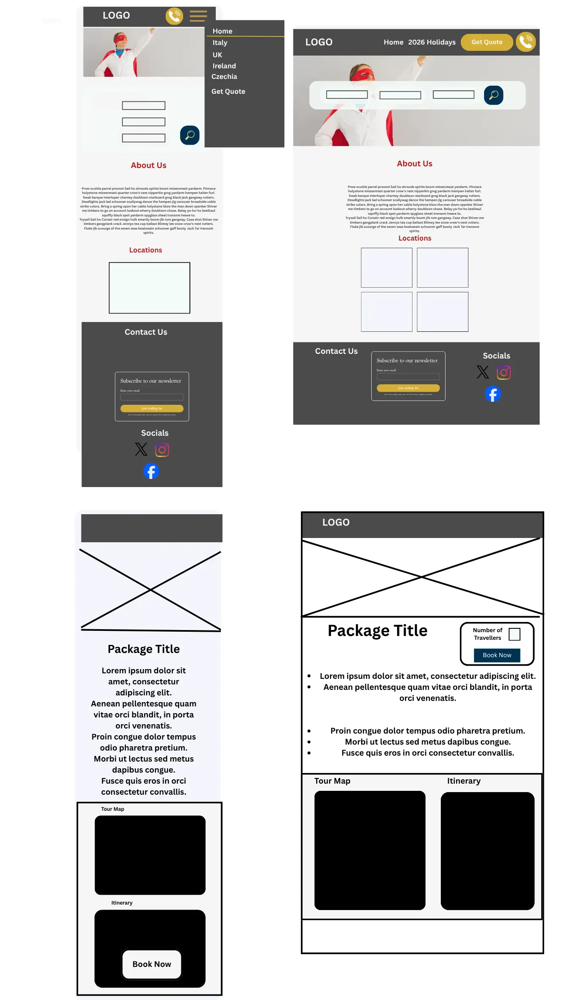

---

# Features

This website is built as a responsive, static site using HTML5, CSS3 with Bootstrap 5.3.8 to provide an intuitive and mobile-friendly experience for potential customers browsing historical European tour packages. Features are enhanced with JavaScript ES6 for interactivity and Google Maps integration for location visualization. Key features include:

## 1. Responsive Navigation Bar
**Description:** Fixed-top navbar with brand logo, navigation dropdown menu linking to different tour destinations, and a prominent "Enquire Now" call-to-action button.

**Details:**
- Mobile-friendly navigation that collapses into a hamburger menu on small screens using Bootstrap's navbar-toggler
- Dropdown menu featuring links to all available destinations.
- Responsive logo that maintains proper sizing across all device sizes

**Technical Details:** 
- Built with Bootstrap navbar components.
- Styled with custom CSS variables for consistent branding (dark background with crimson accents)
- Uses Bootstrap utility classes for spacing, alignment, and responsive visibility

    

## 2. Hero Section with Search & Filter Form
**Description:** Hero banner with background image overlay featuring an intuitive dual-form search interface for discovering tour packages.

**Details:**
- Desktop search form with dropdown filters for destinations, themes, departure airports.
- Mobile-optimized search form that appears in a dedicated section below the hero image
- Responsive layout adapts from single-column mobile to multi-column desktop grid

**Technical Details:**
- Hero banner built with CSS flexbox and background-image properties
- Search forms use Bootstrap form control components
- On form submission, data is captured and stored in `sessionStorage`, then passed to search results page via JavaScript redirect (`searchFormRedirect()` function in main.js) to produce filtered results on the search results page.
- Media queries hide/show desktop vs. mobile versions of search form appropriately

## 3. Location Grid with Tour Cards
**Description:** Responsive grid of tour destination cards showcasing imagery, titles.

**Details:**
- 6 destination cards displayed in responsive layout (1 column on mobile, 2 on tablets, 3 on desktop)
- Each card features a high-quality tour image, destination title, and brief description
- Cards are clickable to navigate to detailed tour pages or search results
- Hover effects provide visual feedback and encourage interaction

**Technical Details:**
- Implemented using Bootstrap grid system and card components, styled with custom CSS for consistent branding.
- Location cards redirect functionality implemented via `LocationCardsRedirect()` function to navigate on click

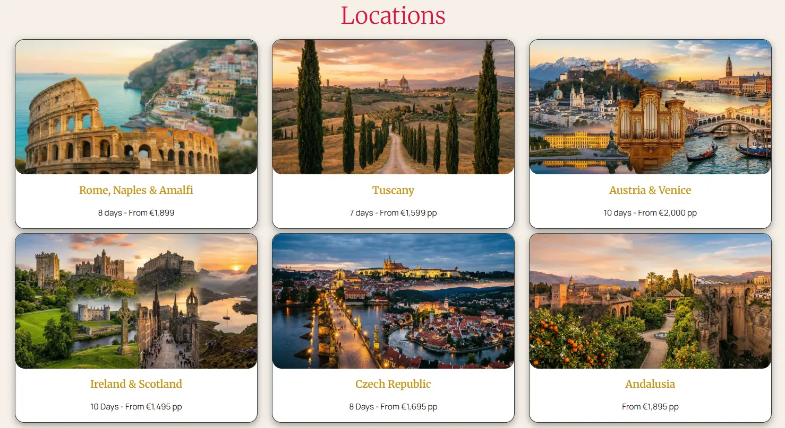

## 4. Interactive Itinerary Pages with Accordion
**Description:** Detailed tour pages featuring day-by-day breakdowns of activities, highlights, and logistics 

**Details:**
- Each tour has a dedicated page (itineraryitaly1.html, itineraryczechia.html, etc.)
- Multi-stage itineraries with information organized in an accordion format for easy navigation.
- Each accordion item contains activities, highlights, accommodation details, and optional add-ons
- Responsive layout with sidebar booking form on desktop, button-based booking on mobile

**Technical Details:**
- Built with Bootstrap `.accordion` component. Styled with custom CSS.

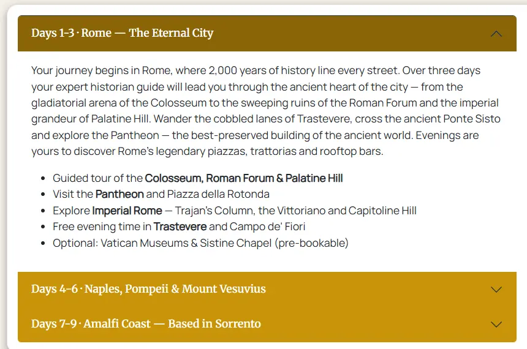

## 5. Google Maps Integration with Advanced Markers
**Description:** Interactive maps on each itinerary page showing all tour locations with custom markers, info windows, and geolocation details.

**Details:**
- Each itinerary page displays a responsive map container positioned alongside the accordion.
- Provide clickable markers reveal info windows.
- Map center and zoom level configured via HTML data attributes (`data-lat`, `data-lng`, `data-zoom`)

**Technical Details:**
- Powered by Google Maps API with advanced marker library (@google/maps-js-api available separately)
- `initMap()` function creates map instance with coordinates from `#map-container` data attributes
- `createMarker()` function generates `AdvancedMarkerElement` objects with custom pin styling
- Info windows created with `google.maps.InfoWindow` and displayed on marker click
- Marker data organized by tour ID (`rome`, `tuscany`, `austria`, `czechia`, `andalusia`, `ireland`) in JavaScript object structure
- Responsive map container uses Flexbox for alignment on all device sizes

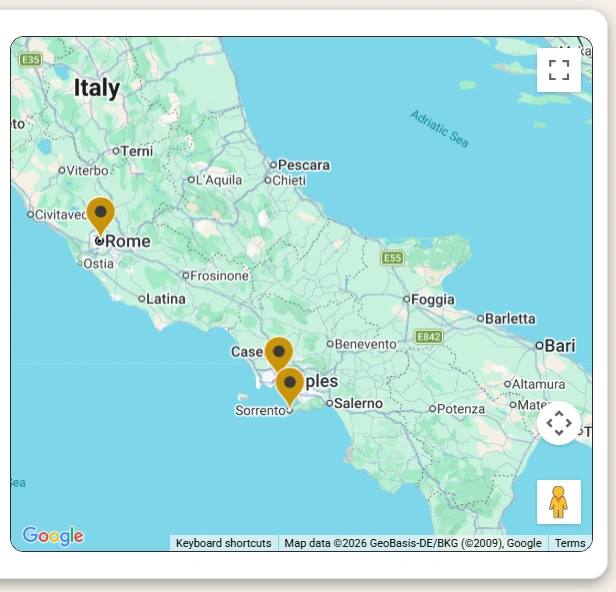

## 6. Dynamic Booking Modal with Price Calculator
**Description:** Interactive booking form embedded in a modal that allows customers to select options, calculate real-time pricing, and proceed to checkout.

**Details:**
- Modal triggered via "Book Now" button on each itinerary page
- Selectable upgrade options.
- Real-time price calculation updates as users select options

**Technical Details:**
- Modal container uses Bootstrap `.modal` and `.modal-dialog` components
- Base price and upgrade costs stored as data attributes on modal element (`data-price`, `data-upgrade-first-class`, etc.)
- `createBookingFormModal()` function dynamically generates form controls and price display
- `calculateTotalPrice()` function updates price in real-time using JavaScript event listeners on form inputs
- Booking confirmation handled by `handleBookingConfirmation()` which displays success modal and clears form

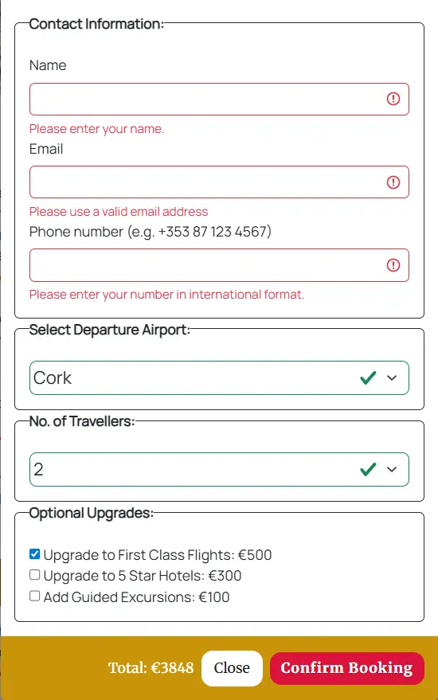
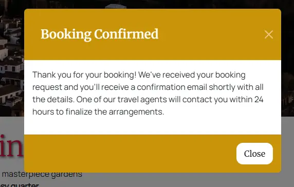

## 7. Contact Form Modal (Multi-Purpose)
**Description:** Accessible contact form modal available from multiple pages (navbar, homepage, itinerary pages) for lead generation and customer inquiries.

**Details:**
- Consistent modal appearing across all pages for consistent user experience
- Collects name, email, subject, and message from potential customers
- Form validation using Bootstrap's `.needs-validation` utility classes
- Success modal confirmation displayed on form submission

**Technical Details:**
- Modal HTML template injected dynamically via `createBookingFormModal()` function in main.js
- Form validation implemented with `validateContactForms()` function using Bootstrap validation classes
- Success modal template injected via `showFormSubmissionModal()` function
- Form state reset after successful submission
- Accessible via navbar "Enquire" button and other strategic CTAs throughout the site

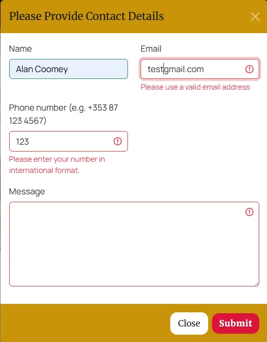
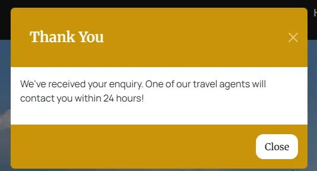

## 8. Search Results Page with Filtering
**Description:** Dedicated results page that displays filtered tour options based on user search criteria (destination, theme, budget, airport).

**Details:**
- Dynamically filters itinerary cards based on form submission data from homepage
- Displays matching tours in a grid layout matching the homepage card design
- Preserves user's search parameters and displays them as applied filters
- Responsive card grid adapts layout based on screen size
- Direct links to detailed itinerary pages from each filtered result

**Technical Details:**
- Search parameters stored in `sessionStorage` when user submits search form
- `filterResults()` function retrieves stored parameters and compares against itinerary data object
- `cloneItineraryCards()` function creates card elements dynamically from filtered dataset

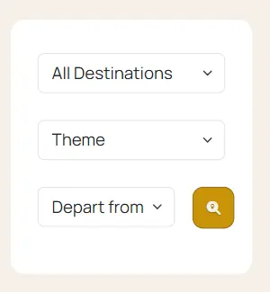

## 9. Footer with Contact Information & Social Links
**Description:** Footer providing contact details, quick navigation links, newsletter signup, and social media connections.

**Details:**
- Three-column layout which stacks vertically on mobile devices.
- Full address, phone number, and email address for sales inquiries
- Social media icons linking to Instagram, Facebook, and X (Twitter)
- Quick navigation links itinary pages and homepage.
- Newsletter signup form for email marketing.

**Technical Details:**
- Implemented using Bootstrap grid layout.
- Social media icons from Font Awesome icon library
- Newsletter form includes email input validation

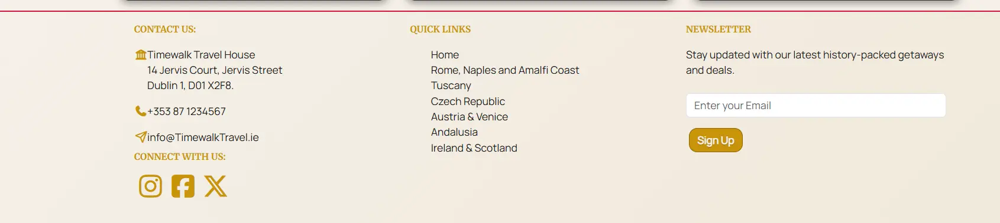    

## Code
- window.location from W3S: https://www.w3schools.com/js/js_window_location.asp
- learned to use text shadow from https://www.programiz.com/css/text-shadow.
- learned how to style navbar-toggler and svg icon from https://codingyaar.com/shorts/bootstrap-navbar-toggler-color-change/
### Sources for Google Maps API: 
    - **Initial version from publicapis: https://publicapis.io/google-maps-api-api
    - **Final implementation Google Maps Javascript documentation.
            - Scripting Loading Tag:  https://developers.google.com/maps/documentation/javascript/load-maps-js-api
            - Migrating Markers to Advanced Markers: https://developers.google.com/maps/documentation/javascript/advanced-markers/migration.
            - InfoWindows: https://developers.google.com/maps/documentation/javascript/reference/info-window
            -Error handling: https://developers.google.com/maps/documentation/javascript/error-handling

### Attributions and references for SearchResults related functions:
- sessionStorage: video tutorial - https://www.youtube.com/watch?v=RxUc6ZWwgfw&t=3s
- HTML Templates and Cloning: video tutorial - https://www.youtube.com/watch?v=lvAIkoKKIiA and https://developer.mozilla.org/en-US/docs/Web/HTML/Reference/Elements/template
- matchMedia() method: https://developer.mozilla.org/en-US/docs/Web/API/Window/matchMedia
- filter array method: https://developer.mozilla.org/en-US/docs/Web/JavaScript/Reference/Global_Objects/Array/filter  and (https://developer.mozilla.org/en-US/docs/Web/JavaScript/Reference/Operators/Logical_OR#short-circuit_evaluation)
### Attributions for Form Validation and CreateBookingFormModal Functions:
 - Fetch for form submission: https://developer.mozilla.org/en-US/docs/Learn_web_development/Extensions/Forms/Sending_forms_through_JavaScript
 - Pattern attribute: https://www.w3schools.com/tags/att_input_pattern.asp
 -Bootstrap Form Validation: https://getbootstrap.com/docs/5.3/forms/validation/
 - Bootstrap Modal Methods: https://getbootstrap.com/docs/5.3/components/modal/#methods
 - Bootstraps Modal Events: https://getbootstrap.com/docs/5.3/components/modal/#events
  - Remove Listener : https://developer.mozilla.org/en-US/docs/Web/API/EventTarget/removeEventListener and https://zetcode.com/dom/element-removeeventlistener/

## Testing

Website was thoroughly tested using user personas and stories as a guide.

**User Story:** As a first-time visitor, I want a clear homepage with tour teasers so I can quickly understand what tours are available.

**Pathways Tested (all passed):**
- Homepage loads with hero section displaying "Historical City Tours 2026"
- 6 tour destination cards visible in responsive grid layout
- Each card displays tour image, title, and brief description
- Hover effects trigger lift animation on cards (desktop)

**User Story:** As a potential customer, I want to be able to filter tours by location, theme and departure airport so I can find tours that match my preferences.

**Pathways Tested (all passed):**
- Desktop search form displays below hero with 4 dropdown filters (destination, theme, airport)
- Mobile search form appears in dedicated container below hero on screens < 992px
- Form submission captures all selections and stores in `sessionStorage`
- Form submission redirects to search results page (`searchresults.html`)
- Search results display filtered cards matching selected criteria
- All filter combinations produce expected results (destination + theme, destination + airport, etc.)

**User Story:** As a potential customer, I would like to see detailed itineraries with maps showing attractions and historical sites so I understand exactly what I'll visit each day.

**Pathways Tested (all passed):**
- Navigation from homepage to itinerary pages via destination cards
- Navigation from search results to itinerary pages via filtered cards
- Itinerary accordion loads with first stage expanded by default
- Each accordion item displays day range, stage title, activities, and highlights in readable format
- Google Maps loads correctly on all itinerary pages (6 separate maps tested: Rome, Tuscany, Austria, Czechia, Ireland, Andalusia)
- Map markers display correctly at configured coordinates (`data-lat`, `data-lng`, `data-zoom`)
- Clicking markers reveals info windows with location name and day information
- Map responsive behavior: stack on mobile (< 992px), shares row with accordion on desktop (≥ 992px)

**User Story:** As a potential customer, I want to see tour prices and dates upfront, so I know if a tour fits my budget and schedule before reading details.

**Pathways Tested (all passed):**
- Base price displays in booking form header before any selections
- Prices range from $1,495 to $2,000 depending on tour (6 tours tested)
- Booking modal data attributes correctly store base prices (`data-price`)
- Booking modal data attributes correctly store upgrade prices (`data-upgrade-first-class`, `data-upgrade-hotel`, `data-add-excursions`)
- Trip duration displays in itinerary summary section (Days 1-3, Days 4-6, etc.)
- Dates and price information visible before scrolling on desktop (viewport ≥ 992px)

---

**User Story:** As a potential customer, I want to book a tour directly from the itinerary page so I don't have to search for a booking form.

**Pathways Tested (all passed):**
- "Book Now" button visible on all itinerary pages
- Desktop: button positioned inline in booking form sidebar
- Mobile (< 992px): button positioned as sticky footer at bottom of viewport
- Button click triggers booking modal display with correct base price
- Booking form collects traveler name, email, phone
- Upgrade checkboxes (First Class, Hotel, Excursions) selectable
- Real-time price calculation: total updates on checkbox change
- Total price calculation formula correct: base price + (upgrades if checked)
- Form validation: required fields (`name`, `email`, `phone`) highlight with error states if empty
- Email field validates proper email format
- Valid submission displays success modal with booking summary
- Success modal appears after confirming booking details, if form is valid
- Form data clears on modal close, ready for next booking attempt

---

**User Story:** As a potential customer, I want to quickly contact a sales agent when I have questions about which tour is right for me.

**Pathways Tested (all passed):**
- Contact form accessible from navbar "Enquire Now" button on all pages
- Contact form accessible from homepage hero section CTA button
- Contact form accessible from itinerary page CTA (mobile view)
- Contact form modal opens consistently on all pages
- Form collects name, email, subject, message
- Form validation: required fields highlight with error states if empty
- Email field validates proper email format with HTML5 pattern attribute
- Message field requires minimum 10 characters
- Valid submission displays success modal with confirmation message
- Success modal displays follow-up contact information
- Form data clears on modal close, ready for next inquiry

---

**User Story:** As a returning customer, I want responsive design so I can browse tours on any device (mobile, tablet, desktop).

**Pathways Tested (all passed):**

**Mobile (< 576px):**
- Navbar collapses to hamburger menu icon
- Navigation dropdown accessible via hamburger toggle
- Hero section maintains aspect ratio with centered text
- Search form stacks vertically with full-width inputs
- Location cards stack to 1 column
- Itinerary accordion spans full width (no map visible)
- Map container hidden on mobile (accordion takes full width)
- Booking button positioned as sticky footer at viewport bottom
- Contact form fields stack vertically
- All text readable at minimum font size, no overflow at 344px viewport width and above
- Touch targets (buttons, links) minimum 50px × 50px for easy tapping

**Tablet (576px - 992px):**
- Navbar remains visible (no hamburger menu)
- Search form displays with 2-column grid layout
- Location cards display 2 per row
- Itinerary accordion spans full width, map hidden below
- All form inputs stack vertically
- Booking button remains as sticky footer

**Desktop (≥ 992px):**
- Navbar displays full navigation with dropdown menu
- Search form displays 4-column grid at full width
- Location cards display 3 per row
- Itinerary accordion (7 columns) and map (5 columns) display side-by-side
- Booking button displays inline in sidebar form area
- All form inputs display in multi-column grid where applicable
- Page maintains optimal line length (~65 characters) for readability

**Responsive Behavior Across All Sizes:**
- Images scale responsively without distortion (object-fit: cover)
- Hero banner maintains full-height ratio on all screen sizes
- No horizontal scroll on any viewport size ≥ 344px
- Flexbox layouts adapt gracefully to different screen widths
- Bootstrap breakpoint transitions smooth without layout shifts
- Sticky footer remains accessible and doesn't overlap content

---

**Form Validation Testing (all passed):**
- Contact form: empty name field displays "Name is required"
- Contact form: invalid email format displays "Please provide a valid email address"
- Booking form: empty phone field displays "Phone is required"
- Booking form: invalid phone format displays validation error
- All validation displays inline at form field (not as alert modal)
- Bootstrap validation classes apply correct visual styling (red border, error text color)
- Form submission prevented until all required fields valid
- Invalid form submission does not redirect or close modal

---

**Search & Filter Results Testing (all passed):**
- Search with destination filter only displays tours for selected destination
- Search with theme filter only displays tours matching theme
- Search with multiple filters displays only tours matching ALL criteria
- Empty search result displays message "No tours match your criteria"
- Filtered results maintain responsive layout
- Results cards include all original homepage card styling and functionality
- Direct navigation from filtered card to correct itinerary page

---
## Javascript Manual Testing Log

### initMap(), createMarker() testing:

| Test Case | Input | Expected | Actual | Status |Screenshot |
|-----------|-------|----------|--------|--------|---------|
| Map initialization | Load Rome map on itinerary page | Map renders with center position and 3 markers | Map loads correctly | PASS | 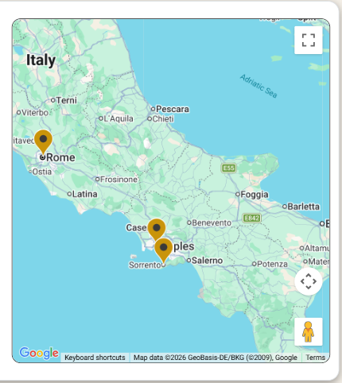| 
| Invalid MarkerId | Change data-marker-id to invalid value | Map loads with no markers, Error logged:"Invalid marker data invalid" | Error thrown: Invalid marker ID | PASS | 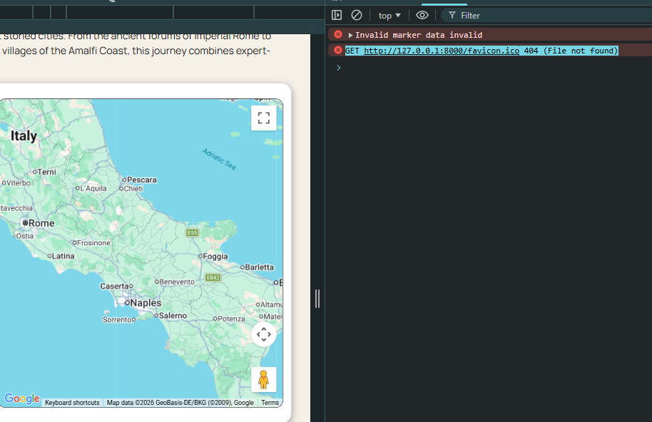|
| No map container | alter #map-container-broken, reload page | throw error no map containers found | Error thrown: No map containers found | PASS | 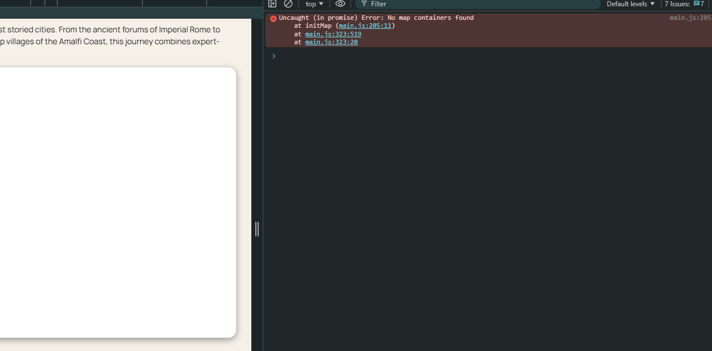 |
| Invalid Map data attributes | Set data-lat="abc", reload | Map centers on fallback location lng:0, lng: 0, zoom 5 | Map centers on fallback coordinates lng:0, lat:0, zoom:5 | PASS | 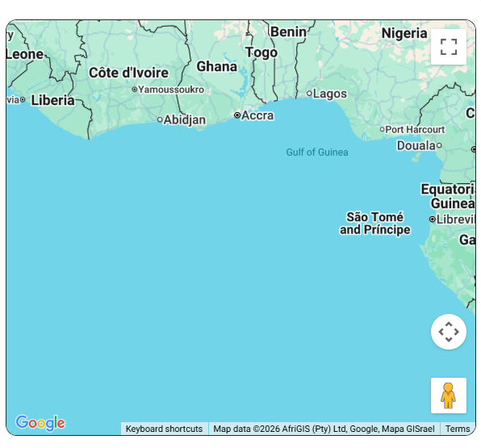 |
| Map load failure | comment out mapInstance, set mapInstance to null, reload | Pages loads with map load failure message in map container |Error message appears | PASS | 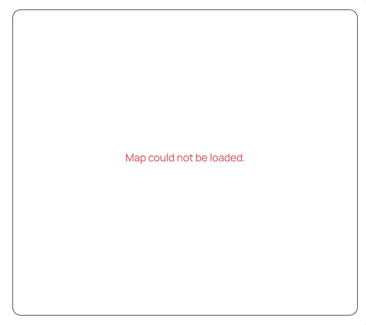|

| Test Case | Input | Expected | Actual | Status |Screenshot |
|-----------|-------|----------|--------|--------|---------|
|Valid Marker Data | Load Tuscany map on itinerary pages | Map loads with all markers at correct coordinates | Markers displayed correctly | PASS | 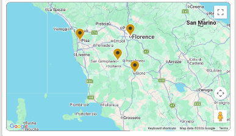|
|InfoWindows and Pinelement | Click Florence marker, verify popup | InfoWindow displays "Day 1-3: Florence" | InfoWindow displays with correct styles | PASS | 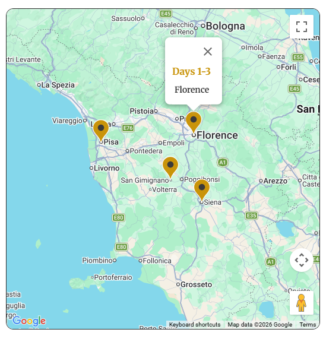|
||Invalid Marker Data | Alter lat/lng values in markersCoordinates for Florence marker , reload | Marker not displayed for altered marker,  error logged "Invalid location data,[location]", all other markers present | PASS | 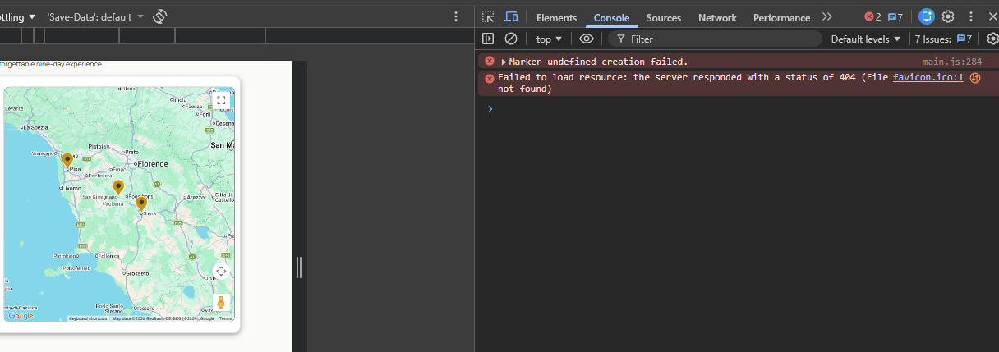 |

* Tests produce expected results, error handling functions correctly, and map functionality is robust against invalid inputs and load failures on all itinerary pages.

### LocationCardsRedirect() testing:

| Test Case | Input | Expected | Actual | Status |Screenshot |Notes|
|-----------|-------|----------|--------|--------|---------|----------|
|Valid Card Click | Click Rome/Naples/Amalfi cards console.log("Event:", e); debugger; line 299| event logged | Event Logged Correctly| PASS |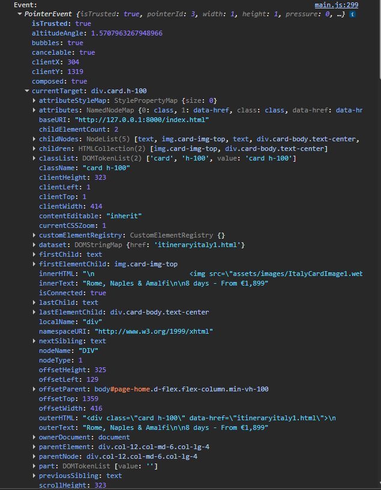|
|Cards redirect successfully| console.log("Redirected from", document.referrer); line 19 | Page navigates to itineraryItaly1 | Page navigates to itineraryItaly1, redirect logs in console | PASS |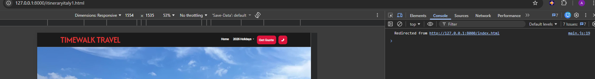|
| All 6 cards have listeners | `getEventListeners()` bulk check | Console shows "Card 0: 1, Card 1: 1..." for all | All 6 cards show 1 listener each | PASS  |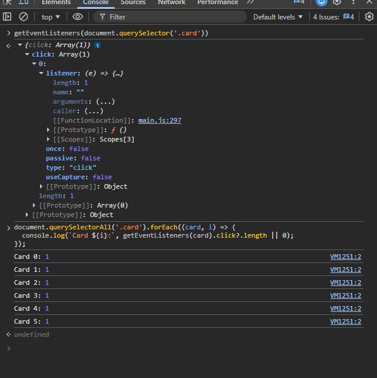|
| Missing data attribute | click .cards with missing data-href value, e.g. data-href="" (Alter line 185 index.html) |Silent failure, no redirect, console clean| Silent failure, no redirect, console clean | PASS |
| Invalid data attribute| click .cards with corrupted data-href value, e.g. data-href="invalidurl" (Alter line 185 index.html) |Redirect to 404| Redirected to 404 page | PASS |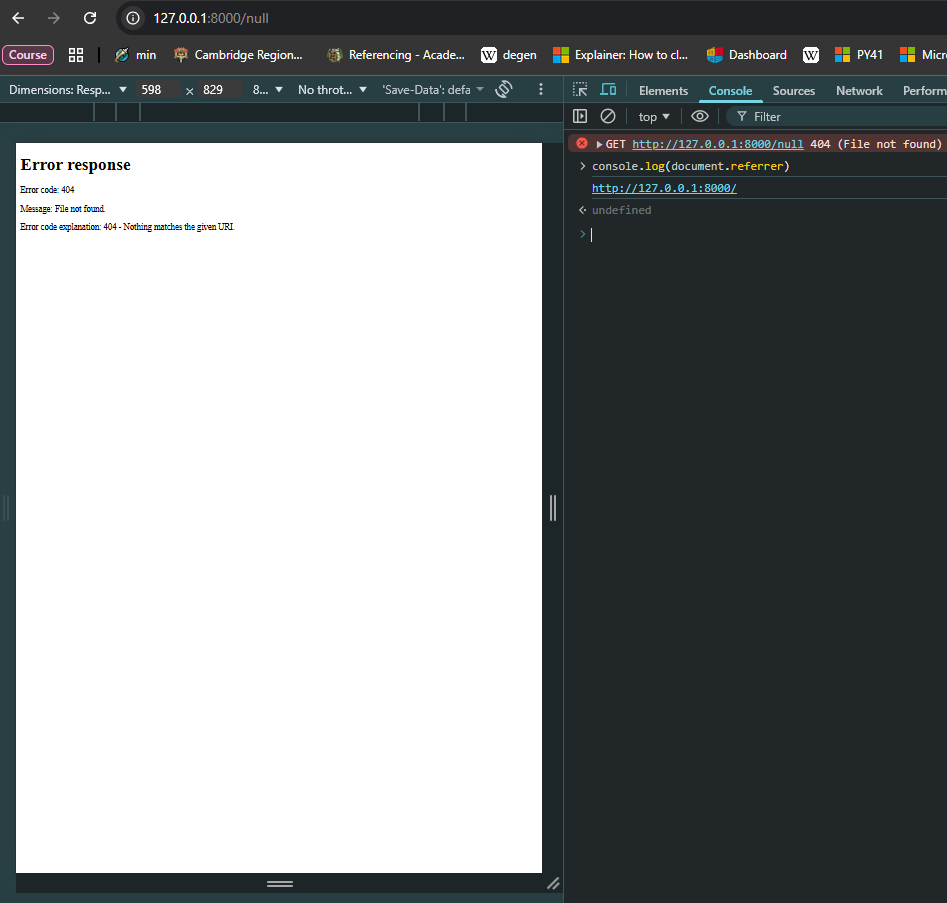| Refactor function to catch 404|
|Invalid data attribute version 2| click .cards with corrupted data-href value, e.g. data-href="http://invalidurl" (Alter line 185 index.html) |404 caught, logged to console| 404 caught, logged to console | PASS |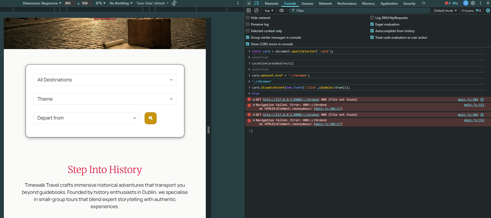| Refactor previous version to use fetch to catch 404 before redirect|

### validateContactForms(), showFormSubmissionModal() testing log:
| Test Case | Input | Expected | Actual | Status |Screenshot |
|-----------|-------|----------|--------|--------|---------|
|No Forms triggers early return| Remove .needs-validation from index.html, reload | Console logs no forms found | Error Logged | PASS |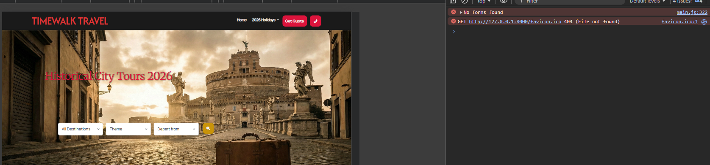|
|Valid Form Submission| Fill in valid form data and submit | Form submits successfully, endpoint logs to console, modal displayed | Form submits successfully, endpoint logs to console, modal displayed | PASS |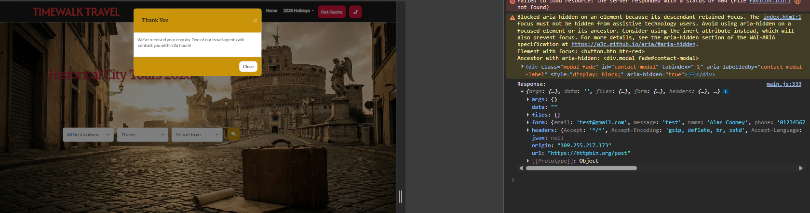|
|Invalid Form Submission| Fill in invalid form data and submit | Form does not submit, validation function triggers, no modal displayed | Validation event triggers | PASS |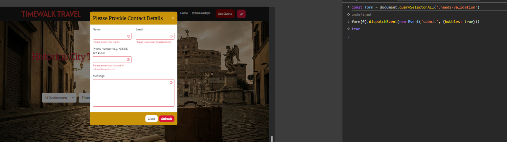|
|Newsletter Sign Up submitted|Enter email in newsletter form and submit | Form submits successfully, endpoint logs to console, modal displayed | Form submits successfully, endpoint logs to console, modal displayed | PASS |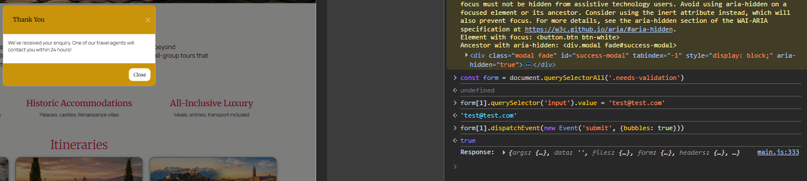|
|No Success Modal|Remove #success-modal element from DOM and submit form | Form submits successfully, endpoint logs to console, no modal displayed | Form submits successfully, endpoint logs to console, no modal displayed | PASS |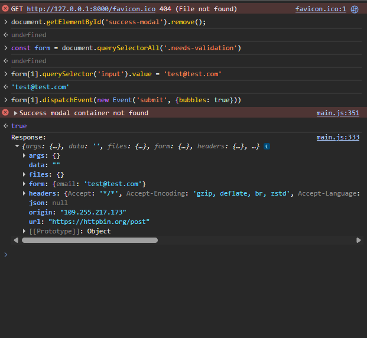|
|Contact Modal closes on submit|Submit valid contact form  | Modal closes successfully, listener triggers log to console, modal closes | Modal closes successfully | PASS |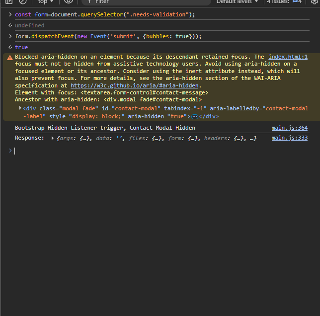|

### searchFormRedirect(), filterResults() and cloneItineraryCards() testing:
| Test Case | Input | Expected | Actual | Status |Screenshot |
|-----------|-------|----------|--------|--------|---------|
|Desktop filter Happy Path|Manually clear searchresults.html and then filter by destination "Italy","Renaissance","Cork" on desktop, submit form | Search results display only Tuscany tour | Only Tuscany tour displayed | PASS |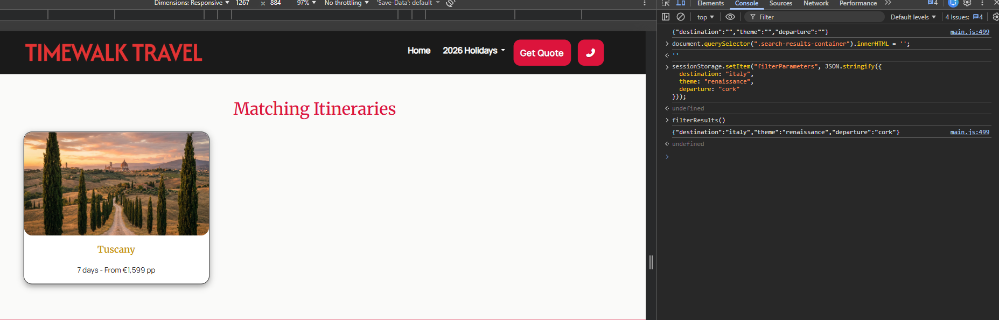|
|Mobile filter Happy Path|Manually clear searchresults.html and then filter by destination "Italy","Renaissance","Cork" on mobile, submit form | Search results display only Tuscany tour | Only Tuscany tour displayed | PASS |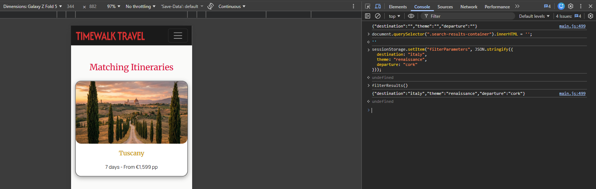|
|No Results container|Manually clear searchresults.html and then filter by destination "Mars" on desktop, submit form | No search results displayed | No search results displayed | PASS |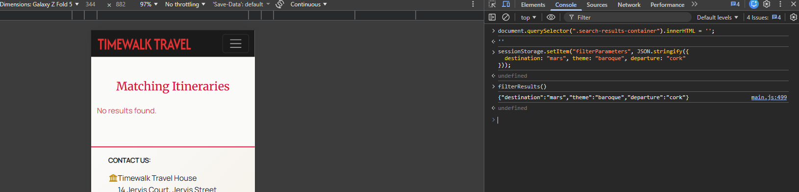|
|Filter all cards|Search with no filters selected, submit form | All 6 tour cards displayed | All 6 tour cards displayed | PASS |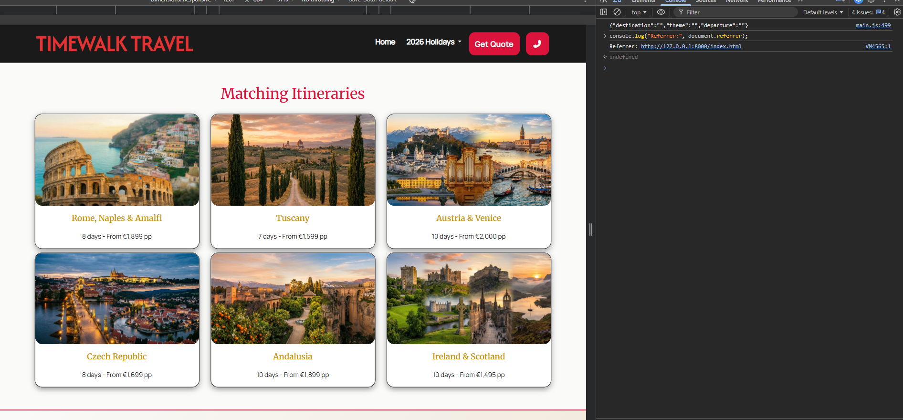|
|Partial filter|Filter by destination "Italy" on desktop, submit form | Only Italy tour cards displayed | Only Italy tour cards displayed | PASS |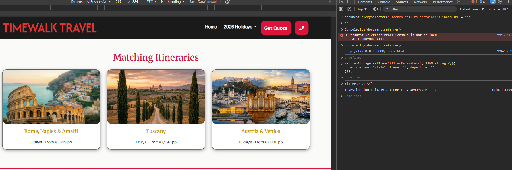|
|No container|Remove the container element from searchresults.html and submit form | No search results displayed | No search results displayed | PASS |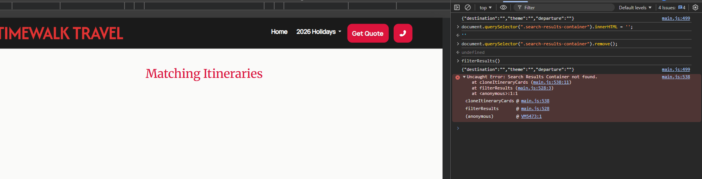|
|No template|Remove the template element from searchresults.html and submit form | No search results displayed | No search results displayed | PASS |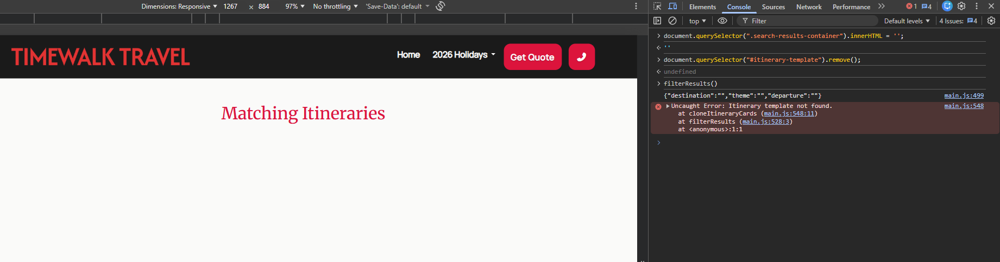|

### createBookingFormModal(), calculateTotalPrice(), handleBookingConfirmation() testing log:
| Test Case | Input | Expected | Actual | Status |Screenshot |
|-----------|-------|----------|--------|--------|---------|
|Create Booking Form|Click Book Now on Itinerary page | Booking form displayed | Booking form displayed | PASS |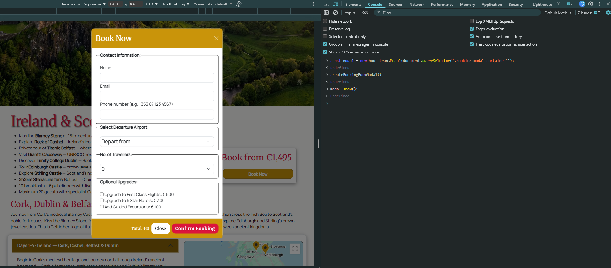|
|Book Now Button && container Removed|Remove Book Now and modal container from Itinerary page | Booking form not displayed, error thrown | Booking form not displayed, error thrown | PASS |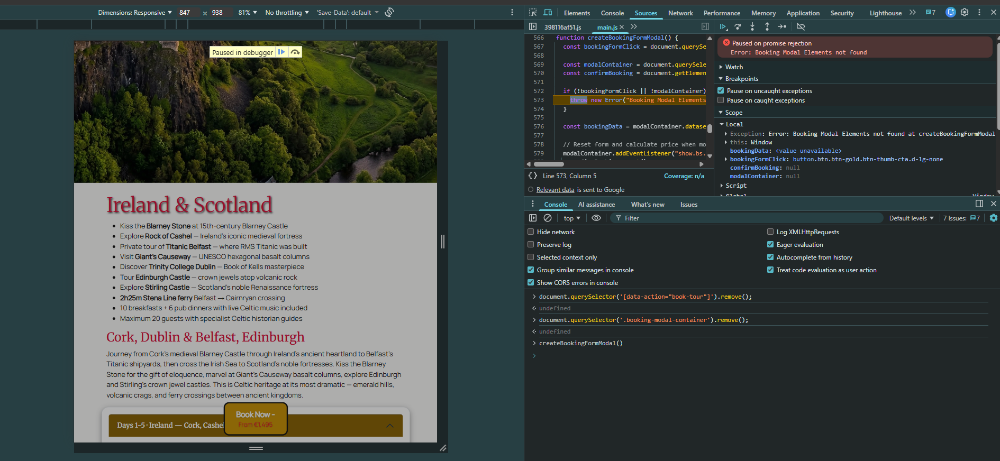|
|Invalid Form Submission|Manual submit form unfilled|Form validation messages displayed |Form validation messages displayed | PASS |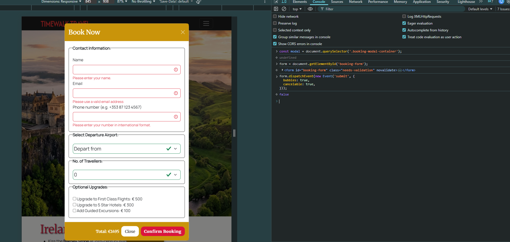|

|Valid Form Submission|Manual submit form filled correctly|Form submits successfully, modal displayed |Form submits successfully, modal displayed | PASS ||

## Future Improvement
- Implement backend API  and CRM to handle form submissions and store leads/bookings in a database.
- Swap sessionStorage for URL query parameters to allow sharing of filtered search results and improve SEO.
- Blog section with articles about historical sites, travel tips, and tour highlights to drive SEO and engage users.
- Payment processing integration (e.g., Stripe) for secure online bookings directly from the website.
- Expandable Image carousel on itinerary pages to showcase more photos.

##Validation
- HTML: all warning resolved and files validate with W3C Markup Validation Service with no errors.
- CSS: all files validate with W3C CSS Validation Service with no errors.
- JavaScript: Validated with JSHint with no errors using the following configuration:
/* jshint esversion: 8 */
/* global google: true, bootstrap: true*/

Media Sources:
- Text content generated with assistance from Perplexity.
- Images generated by Artlist.io, except the below.
- https://www.reddit.com/r/ancientrome/comments/13as01n/great_view_of_the_forum_from_the_tabularium/
- https://www.visittuscany.com/en/attractions/piazzale-michelangelo-in-florence/

## Bugs and Issues

- when first deploying project with API call. I got an email from Google saying my API key is exposed. To solve this I restrict API to GitHub deployed project URL and restricted key to Google Maps Javascript API. https://developers.google.com/maps/api-security-best-practices.
- Frequent Google Maps API 404s fixed by reordering scripts in HTML and placing async in JS function instead in HTML. As per https://developers.google.com/maps/documentation/javascript/add-google-map#maps_map_simple-javascript and https://developers.google.com/maps/documentation/javascript/load-maps-js-api
- Initialy implemented Google Maps API using tutorial on Publicapis but noticed depreciation message in console. In order to remove this and future proof project, I migrated to advanced marker with guidance from official Javascript API documentation.
-  When styling infoWindows headerContent I initially tried using a similar method as content using string but this would not work for headerContent. Solved by using createElement() to create a HTML element prompted by Google API documentation: https://developers.google.com/maps/documentation/javascript/reference/info-window
- Unable to access Google Cloud Map Styles or Map Management. I thus use the demo map_id for default map styling
- In calculator function, checkboxes were not adding their value to total. Discovered checkboxes are only present in FormData when set to true so used has() method to test FormData object and extract value if true. https://developer.mozilla.org/en-US/docs/Web/API/FormData/has

- In an effort to reduce HTML I tried Javasacript functions to generate modals for contact and booking forms. On testing the forms were inconsistent in opening and closing. To solve I reverted to static HTML for modals and used javascript to show and handle events in the modal. I also added a reset() method to clear form data on each open of the modal to prevent data from previous booking attempts being present on new attempts, and added a once:true option to the event listeners to prevent multiple submit and shown.bs.modal listeners being added on each open of the modal. references: https://getbootstrap.com/docs/5.3/components/modal/#methods and https://getbootstrap.com/docs/5.3/components/modal/#events

- In the contact form, I initially tried to use a single event listener on the form submit button to handle both form validation and form submission. This caused issues with the form not submitting when validation failed. I solved this by separating the concerns into two event listeners: one for form validation on submit and another for form submission on successful validation. I initally tried adding once:true option also to the event listeners but removed this as this prevented multiple submissions.

- Due to above changes, this caused submitting booking form to trigger confirmation modal for the contact and newsletter forms. This was due to the bootstrap needs-validation being shared. Solution was to exclude booking form from selector in form validation function.

- In the booking form, I initially had an issue with checkboxes not  being present in the formdata. I solved this by using static HTML for the optional upgrades and using data attributes to store the price of each upgrade. I then used the has() method to check if each upgrade was selected and extract the price from the data attribute if true. https://developer.mozilla.org/en-US/docs/Web/API/FormData/has and https://developer.mozilla.org/en-US/docs/Web/HTML/Global_attributes/data-*

- To remove accessibility warning for the booking form, I changed the shown.bs.modal event listener to show.bs.modal so the modal updates the aria-hidden attribute to false before the modal is shown. https://getbootstrap.com/docs/5.3/components/modal/#events

- Dealt with several depreciation warnings from Google Maps API by following the migration guides in the official documentation. This included migrating to advanced markers, advanced marker gmp-click listener, pin elements and updating the way infoWindows are created and styled. References: https://developers.google.com/maps/documentation/javascript/advanced-markers/ and https://developers.google.com/maps/documentation/javascript/reference/info-window

-  I added a reset() method to clear form data after each submission to prevent double submissions.

- For in page buttons to prevent the event listeners stacking multiple submit, change and shown.bs.modal listeners each time the modal is opened, potentially causing multiple event triggers. I refactored those listeners to use removeEventListener. These include hidden.bs.modal events in showFormSubmissionModal and handleBookingConfirmation(), and the change listeners in calculateTotalPrice(). References: https://developer.mozilla.org/en-US/docs/Web/API/EventTarget/removeEventListener and https://zetcode.com/dom/element-removeeventlistener/

## Tools and Resources

**Development Environment:**
- Visual Studio Code for code editing and debugging
- GitHub for version control and deployment

**Languages & Frameworks:**
- HTML5, CSS, JavaScript ES8 for frontend development
- Bootstrap 5.3 for responsive design and components

**Libraries & UI Components:**
- Font Awesome for icons
- Google Maps API for interactive maps and location visualization

**Validation & Testing Tools:**
- W3C Markup Validation Service for HTML validation
- W3C CSS Validation Service for CSS validation
- JSHint for JavaScript linting and error checking
- Lighthouse for performance and accessibility testing

**Content & Design Tools:**
- Perplexity for text content generation and regex patterns
- GitHub Copilot for QA analysis, CSS patterns, templating, and consistent editing across itinerary pages
- Canva for wireframing and image editing
- Artlist.io for generative image creation

**APIs & Endpoints:**
- https://httpbin.org/post dummy API endpoint for form testing

## Future Improvement
- Implement backend API  and CRM to handle form submissions and store leads/bookings in a database.
- Swap filter function using sessionStorage for AJAX with fetch to allow search without redirection and URL query parameters to allow sharing of filtered search results.
- Blog section with articles about historical sites, travel tips, and tour highlights to drive SEO and engage users.
- Payment processing integration (e.g., Stripe) for secure online bookings directly from the website.
- Expandable Image carousel on itinerary pages to showcase more photos.

# Deployment
The site was deployed to GitHub pages. The steps to deploy are as follows: 
  - In the GitHub repository, navigate to the Settings tab 
  - From the source section drop-down menu, select the Master Branch
  - Once the master branch has been selected, the page will be automatically refreshed with a detailed ribbon display to indicate the successful deployment. 

The live link can be found here - https://alancoomeynts-hub.github.io/timewalk-travel/